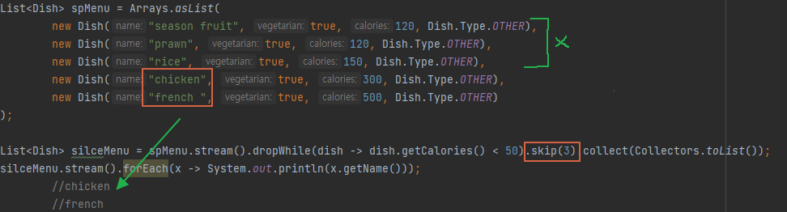
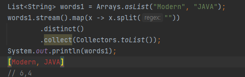

# 스트림활용

### 5.1
# 필터링
## 5.1.1 프레디케이트로 필터링
- 스트림 인터페이스는 filter메서드를 지원한다.
필터메서드는 프레디케이트를 인수로 받아서 프레디케이트와 일치하는 모든 요소를 포함하는 스트림을 반환한다.

```java
List<Dish> vagiMenu = vagiMenu.stream().filter(Dish::isVegetarian).collect(Collectors.toList());

//Dish::isVegetarian 채식요리인지 확인하는 메서드 참조

```

## 5.1.2 고유 요소 필터링
- 스트림은 고유요소로 이루어진 스트림을 반환하는 distinct 메서드도 지원한다.
고유여부는 스트림에서 만든 객체의 hashCode, equals로 결정된다.


- 중복을 필터링

### 5.2 스트림 슬라이싱
## 5.2.1 프레디케이트를 이용한 슬라이싱
- 자바9는 스트림의 요소를 효과적으로 선택할 수 있도록 takewhile, dropwhile 두 가지의 새로운 메소드를 지원한다.

## TAKEWHILE 활용
- 무한 스트림을 포함한 모든 스트림에 프레디케이트를 적용해 스트림을 슬라이스 할 수 있다.


## DROPWHILE 활용
- 300 칼로리보다 큰 요소를 탐색
- 선언한 조건의 정반대를 가져온다.


## 5.2.2 스트림 축소
- limit을 사용하여 최대 요소n 개를 반환한다. 처음 일치하는 limit이 완료되면 반환


- 정렬되지 않은 스트림에도(Set) limit을 사용할 수 있다.
소스가 정렬되어있지 않았다면 limit도 정렬되지 않은 상태로 반환한다.

## 5.2.3 요소 건너뛰기
- 스트림은 처음 n개 요소를 제외한 스트림을 반환하는 skip(n) 메서드를 지원한다.
limit과 상호보완적이다. skip(2) 인 경우 처음 2개를 건너뛴 후 반환한다.



    
-> 미트 타입의 요리 필터링 (enum)


# 5.3 매핑
- 특정 객체에서 특정 데이터를 선택하는 작업은 데이터 처리 과정에서 자주 수행되는 연산이다. 예를 들어 SQL 테이블에서 특정 열만 선택하는 기능이며 스트림 API의 map과 flatMap 메서드는 특정 데이터를 선택하는 기능을 제공한다.

## 5.3.1 스트림의 각 요소에 함수 적용
- 스트림은 함수를 인수로 받는 map 메서드를 지원한다.
인수로 제공된 함수는 각 요소에 적용되며 함수를 적용한 결과가 새로운 요소로 맵핑된다.
- 변환이 아닌 매핑이라는 사용한다.

- Dish::getName을 map메서드로 전달해서 스트림의 단어 길이 추출


## 5.3.2 스트림의 평면화
- 고유문자로 이루어진 리스트 반환

- 이 소스에서 map으로 전달한 람다는 각 단어의 String[]을 반환하는것이 문제이다.
- 각 단어를 개별 문자열로 이루어진 배열로 만든 후 각 배열을 별도의 스트림으로 만들어야한다. (Arrays::stream)

## flatMap 사용


- flatMap은 각 배열을 스트림이 아니라 스트림 콘텐츠로 매핑한다.
즉 map(Arrays::stream)과 달리 flatMap은 하나의 평면화된 스트림을 반환한다.
- flatMap은 스트림의 각 값을 다른 스트림으로 만든 다음에 모든 스트림을 하나의 스트림으로 연결하는 기능을 수행한다.

## 두 개의 숫자 리스트가 있을때 모든 숫자쌍의 리스트 반환
[1,2,3], [3,4]


-

# 5.4 검색과 매칭
- 특정 속성이 데이터 집합에 있는지 여부를 검색하는 데이터 처리도 자주 사용된다.
- allMatch, anyMatch, noneMatch, findFirst, findAny 가 제공된다.

## 5.4.1 프레디케이트가 적어도 한 요소와 일치하는지 확인
- 적어도 한 요소와 일치하는지 확인할 때 anyMatch 메서드를 이용한다.


```java
if(spMenu.stream().anyMatch(Dish::isVegetarian)){
            System.out.println("anymatch! ");
}else{
            System.out.println("none");
}
```
- 야채부분이 false인 경우 none으로 들어간다.

## 5.4.2 프레디케이트가 모든 요소와 일치하는지 확인

```java
if(spMenu.stream().allMatch(a -> a.getCalories() > 10)){
            System.out.println("allMatch! ");
        }else{
            System.out.println("none");
        }
```
- 칼로리가 10 이상인 경우가 모두 해당되야한다.
모두 맞으면 allMatch된다.


# NONEMATCH
- allMatch반대 즉 주어진 프레디케이트와 일치하는 요소가 없는지 확인한다.

```java
if(spMenu.stream().noneMatch(a -> a.getCalories() > 10)){
            System.out.println("noneMatch! ");
        }else{
            System.out.println("none");
        }
```
- 모든 요소가 해당되지 않아야 noneMatch로 갈 수 있다.

    - anyMatch, allMatch, noneMatch 세 메서드는 스트림 쇼트기법 즉 자바의 && || 와 같은 연산을 활용한다.
    - 모든 스트림 요소를 처리하지 않고도 결과 반환, 원하는 요소를 찾으면 즉시 반환한다.

## 5.4.3 요소검색
- findAny메서드는 "임의"라기보단 가장 먼저 탐색된 요소를 반환한다. (임의는 오타인거같음)
- 다른 스트림연산과 연결해서 사용 가능하다.
- findFirst는 일치하는 요소들 중 Stream에서 가장 앞에 있는 요소를 리턴함
    - 직렬로 처리하면 차이가 없으나 병렬로 할때는 차이가 있다.
    - 병렬 처리할때는 뒤쪽에서 먼저 찾아질 수도 있다.


# Optional
- 값의 존재나 부재여부를 표현하는 컨테이너 클래스
- isPresent() : 값을 포함하면 true반환 / 없으면 false 반환
- ifPresent() : 값이 있으면 주어진 블록을 실행한다.
- T get() : 값이 존재하면 값을 반환하고 없으면 NoSuchElementException을 일으킨다.
- T orElse : 값이 있으면 값을 반환하고, 값이 없으면 기본값을 반환한다.

## 5.4.4 첫번째 요소 찾기
- findFirst와 findAny는 언제 사용할까 
    - 병렬성 때문에 2가지가 필요하다.
    - 병렬 실행에서는 첫번째는 찾기 어렵기 때문이다.
    - 순서가 상관없다면 병렬 스트림에서는 제약이 적은 findAny를 사용한다.

## 5.5 리듀싱 (171P)
- 모든 스트림요소를 처리해서 값으로 도출하는 과정 (모든 스트림의 합 등..)

```java
int sum = numbers.stream().reduce(0, (a,b) -> a+b);
```
- 초기값 0
- 람다를 통해 모두 합산

- 스트림이 하나의 값으로 줄어들때까지 람다는 각 요소를 반복해서 조합한다.
- 메서드 참조를 통해 더 간단하게 가능  -> Integer::sum
```java
int sum = numbers.stream().reduce(0,  Integer::sum);
```

- 초기값을 받지 않도록 오버로드된 reduce도 존재한다.
```java
Optional<Integer> sum = numbers.stream().reduce((a,b) -> (a+b));
```
- 스트림에 아무것도 없는 경우 합계 반환이 불가하므로 Optional 객체로 감싼 결과를 반환한다.

## 5.5.2 최댓값과 최솟값
```java
Optional<Integer> sum = numbers.stream().reduce(Integer::max);
Optional<Integer> sum = numbers.stream().reduce(Integer::min);
```

## 지금까지 배운 연산 176P

## 5.7.1 기본형 특화 스트림
 - 3가지 기본형 특화 스트림이 있다.
 - int요소에 특화된 IntStream, double 요소에 특화된 DoubleStream, Long요소에 특화된 LongStream을 제공한다
 - 각각의 인터페이스느 숫자 스트림의 합계를 계산하는 sum, 최댓값 요소를 검색하는 max
 등의 자주 사용하는 숫자 관련 리듀싱 연산 수행 메서드를 제공한다.
 - 다시 객체스트림으로도 복원하는 기능도 제공한다.

 ## 숫자 스트림으로 맵핑
 - 스트림을 특화 스트림으로 변환할 때는 mapToint, mapToDouble, mapToLong 세 가지 메서드를 가장 많이 사용한다.
 - map과 정확히 같은 기능이지만 Stream<T\> 대신 특화된 스트림을 반환한다.

 - mapToInt 메서드는 추출 후 IntStream을 반환한다. (Stream integer를 반환하지 않음)
 또한 스트림이 비어있으면 0을 반환한다.

 ## 객체 스트림으로 복원
 ```java
Stram<Integer> stream = intStream.boxed(); //숫자 스트림을 스트림으로 변환
 ```
 
 ## 기본값 : OptionalInt
 - 최대값을 찾을때 0으로 인하여 잘못된 결과가 발생 할 수 있다.
 이를 구별하기 위해 컨테이너 클래스 Optional이 있다.
 ```java
OptionalInt maxCal = menu.stream().mapToInt(Dish::getCalories).max();
int max = maxCal.orElse(1); //값이 없을 때 기본 최대값을 명시적으로 설정
 ```

 
 ## 5.7.2 숫자범위
 - 1~100사이의 숫자를 생성할때 range, rangeClosed 와 같은 정적메서드를 제공한다.
 - range메서드는 시작값과 종료값이 결과에 포함되지 않는다.
 - rangeClosed는 포함된다.

 ```java
IntStream evenNumbers = IntStrea.rangeClosed(1,100)
 ```

 ## 5.8.1 값으로 스트림 만들기
  - 임의의 수를 인수로 받는 정적 메서드 Stream.of를 이용해서 스트림을 만든다.
  - 스트림의 모든 문자열을 대문자로 변환 후 문자열을 하나씩 출력한다.


- Stram.empty()를 통해 스트림을 비울 수 있다.

## 5.8.2 null이 될 수 있는 객체로 스트림 만들기
- null이 될 수 있는 개체를 스트림을 만든다.
- 예를 들어 system getProperty가 null일때가 있다.


- ofNullable을 이용하여 구현
- null이 될 수 있는 객체를 포함하는 스트림 값을 flatMap과 사용하여 유용하게 쓸 수 있다.


## 5.8.3 배열로 스트림 만들기
```java
int [] numbers = {2,3,4,5,6};
int sum = Arrays.stream(numbers).sum();

```

- 스트림은 자원을 자동으로 해제하는 AutoCloseable 이므로 try-finally 가 필요없다.


## 5.8.5 함수로 무한스트림 만들기
- Stream.iterate, Stream.generate 정적 메서드
- 두 연산으로 무한스트림 즉 크기가 고정되지 않은 스트림을 만들 수 있다.
- 보통 무한하지 않도록 limit을 같이 쓴다.
- iterate는 기존결과에 의존해서 순차적으로 연산을 수행한다.
요청할때마다 값을 생산 할 수 있어 이런 스트림을 언바운드 스트림이라고 한다.


