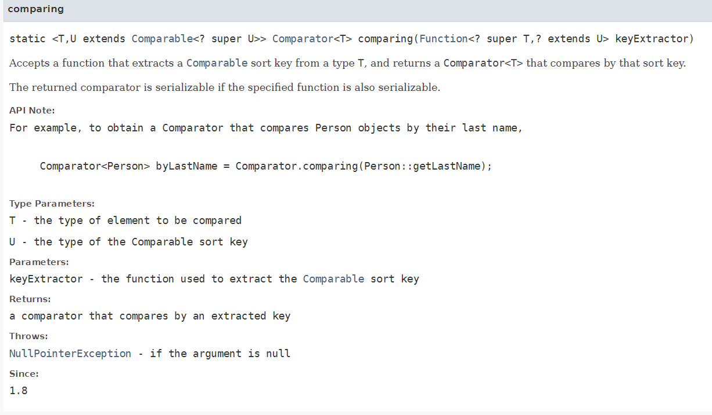

# Chapter 3 람다 표현식

## 3.1 람다란 무엇인가?

- 메서드로 전달할 수 있는 익명 함수를 단순화 한 것
    - 익명 : 보통 메서드와 달리 이름이 없음
    - 함수 : 메서드와 달리 특정 클래스에 종속되지 않는 것 , 메서드처럼 파라미터 , 바디 , 반환 형식 등을 포함
    - 람다 표현식은 메서드 인수로 전달하거나 변수로 저장할 수 있다.
    - 간결성 : 익명 클래스처럼 많은 코드를 구현할 필요 X

```java

Comparator<Apple> byWeight = new Comparator<Apple>() {
	public int compare(Apple a1 , Apple a2) {
		return a1.getWeight().compareTo(a2.getWeight());
	}
};

Comparator<Apple> byWeight = 
	(Apple a1 , Apple a2) -> a1.getWeight().compareTo(a2.getWeight());
```

람다로 간단해진 코드

(Apple a1 , Apple a2 ) `람다 파라미터` → a1.getWeight().compareTo(a2.getWeight()); `람다 바디`

- 화살표는 파라미터 리스트와 바디를 구분

- 람다 표현식 예시
    1. ( String s ) → s.length() ⇒ String 파라미터 하나와 int 값 반환 `return 생략 가능`
    2. ( Apple a ) → a.getWeight() > 150 ⇒ Apple 파라미터 하나 , boolean 리턴
    3.

     ```java
     ( int x , int y ) → { 
         System.out.println(”Result”); 
         System.out.println( x + y );
     }
     int 파라미터 두개와 리턴값 X
     
     ```

    4. () → 42 ⇒ 파라미터 값 없이 int 값 42 반환
    5. (Apple a1 , Apple a2 ) → a1.getWeight().compareTo(a2.getWeight())

       ⇒ Apple 두개 파라미터 , 무게 비교 결과값 int 반환


    - (parameters) → expression ⇒ `표현식 스타일`
    - (parameters) → { statements; } ⇒ `블록 스타일`


## 어디에 어떻게 람다를 사용할까?

어디에 ⇒ 함수형 인터페이스에

- 함수형 인터페이스 인스턴스를 생성할 때
- 함수형 인터페이스를 인수로 하는 메서드에

어떻게 사용할까?

- 함수형 인터페이스 안에 있는 추상메서드의 시그니처에 맞게 람다 표현식을 사용해야한다.

‼️ @FunctionalInterface : 함수형 인터페이스를 가리키는 어노테이션 , 실제 함수형 인터페이스가 아니면 오류가 발생 → 추상메서드가 두개일 경우 등

## 실행 어라운드 패턴

- 책 내용이 이해가 안되어서 구글링


- `준비`와 `정리` 부분은 틀처럼 정해져 있고 실행부분만 바뀌는 코드의 형태

### 3.3.1 ~ 3.3.4

기존의 코드에서 함수형 인터페이스로 인수를 변경하고 , 해당 동작을 람다표현식으로 전달해서 실행 어라운드 패턴으로 변경

```java
// first 
public String processFile() throws IOException {
	try ( BufferedReader br = new BufferedReader(new FileReader("data.txt"))) {
		return br.readLine();
	}
}

// 함수형 인터페이스 
public interface BufferedReaderProcessor {
	String process(BufferedReader p) throws IOException; // 추상 메서드 
}

// 인수를 함수형 인터페이스인 BuffredReaderProccessor로 변경 
// return 값에 함수형 인터페이스의 추상 메서드 process값으로 선언
public String processFile(BufferedReadderProccessor p) thorw IOException {
	try (BufferedReader br = new BufferedReader (new FileReader("data.txt"))) {
		return p.process(br);
	}
}

// 람다 표현식 사용 
// (BufferedReader br) -> br.readLine(); 
// 인수 BufferedReader 형태 객체 , 반환 값 String 값 
// 해당 람다 표현식은 추상메서드인 process 의 시그니처(함수 디스크립터)와 같기 때문에 알맞은 람다 표현식 
String oneLine = processFile((BufferedReader br) -> br.readLine());

String twoLines = processFile((BufferedReader br) -> br.readLine() + br.readLine());

```

## 3.5 형식 검사 , 형식 추론 , 제약

- 형식 검사 : 메서드 파라미터 , 함수형 인터페이스의 인스턴스에 할당되는 람다 등에서 기대되는 람다 표현식의 형식을 `대상 형식`

  ⇒ 람다 표현식과 함수형 인터페이스의 형태의 같음을 검사하는 것을 `형식 검사`라 이해

  - 형식 검사의 과정
    1. 람다가 사용된 콘텍스트가 무엇인지 파악 → ex) filter의 정의를 확인

       ⇒ filter(inventory , (Apple a) → a.getWeight() > 150 ) ; `람다 형식` 확인

    2. 대상 형식은 Predicate<Apple> 이다

       ⇒ filter ( List<Apple> inventory , Predicatie<Apple> p )

    3. Predicate<Apple> 인터페이스의 추상 메서드 파악

       boolean test(Apple apple)

    4. Apple을 인수로 받아 boolean 반환하는 test 메서드

       ⇒ Apple → boolean

    5. 함수 디스크립터를 파악해서 람다의 시그니처와 비교 ⇒ 일치하면 형식 검사 완료

- 형식 추론 : 람다의 시그니처와 함수형 인터페이스의 추상메서드의 형태를 추론해서 파라미터 형태를 생략할 수 있다 .

    ```java
    Comparator<Apple> c = (Apple a1 , Apple a2) -> a1.getWeight().compareTo(a2.getWeight());
    
    Comparator<Apple> c = (a1 , a2) -> a1.getWeight().compareTo(a2.getWeight());
    ```


- 지역 변수 사용과 제약

  람다 표현식의 바디에는 인수 뿐만아니라 **자유변수**(파라미터로 넘겨진 변수가 아닌 외부에서 정의된 변수) 를 사용 할 수 있다. ⇒ `람다 캡처링`

    - 자유 변수에 있는 제약 : 인스턴스 변수와 정적 변수를 자유롭게 캡처할 수 있지만 그러려면 지역 변수엔 fianl로 선언되어 있어야 한다. ⇒ 람다 표현식은 한 번만 할당할 수 있는 지역 변수를 캡처할 수 있다.

  ❓ 인스턴스 변수 , 정적 변수 , 지역변수 개념

- 왜 지역 변수에는 제약이 필요한가?

  ⇒ 인스턴스 변수와 지역 변수는 태생부터 다름 `인스턴스` 변수는 힙메모리에 , `지역` 변수는 스택 메모리에 위치

  ❓ 힙메모리와 스택 메모리의 차이


#### 🤦‍♂️ 지역 변수의 제약에 대한 이해는 바로 되진 않지만,  람다 표현식 안에 람다 캡처링을 사용할 변수는 값이 바뀌지 않아야 한다는 것으로 이해

## 3.6 메서드 참조

<aside>
💡 메소드 참조(method reference)는 람다 표현식이 단 하나의 메소드만을 호출하는 경우에 해당 람다 표현식에서 불필요한 매개변수를 제거하고 사용할 수 있도록 해줍니다.

</aside>

- 특정 메서드를 참조하는 람다의 축약형 ⇒ 명시적인 메서드명을 넣어서 `가독성`을 높일 수 있음

람다 → 메서드 참조 예제

```java
 (Apple apple) -> apple.getWeigth()  || Apple::getWeight
 () -> Thread.currentThread().dumpStack() || Thread.currentThread()::dumpStack
 (str , i ) -> str.substring(i) || String::substring 
```

### 메서드 만드는 방법

1. 정적 메서드 참조
2. 다양한 형식의 인스턴스 메서드 참조
3. 기존 객체의 인스턴스 메서드 참조

```java
- 람다 표현식 
(args) -> ClassName.staicMethod(args)
-> 메서드 참조 ( 정적 메서드 참조 ) 
ClassName::staticMethod 

(arg0, rest) -> arg0.instanceMethod(rest)
-> 인스턴스 메서드 참조 
ClassName::instanceMethod 

=> arg0 은 ClassName 타입

(args) -> expr.instanceMethod(args) 
-> expr:: instanceMethod ( 할당한 객체의 인스턴스 메서드 참조 ) 

```

- 메서드 참조 역시 함수형 인터페이스의 컨텍스트와 호환이 필요

### 생성자 참조

`ClassName::new` 를 사용해서 기존 생성자의 참조를 만들수 있다.

함수형 인터페이스의 형식에 맞는 생성자가 있는  클래스는 new 생성자 참조로 객체를 생성할 수 있다.

```java
Apple ( Integer weight ) 생성자를 가지고 있는 Apple 클래스 

Function<Integer , Apple> c2 = Apple::new; 
Apple a2 = c2.apply(110);

Function의 함수 디스크립터 
Function<T,R> T -> R 

생성자와 함수 디스크립터가 맞으므로 생성자를 참조해서 사용할 수 있다. 
여기서 apply 함수의 매개변수 타입은 Integer , 반환 타입은 Apple이 되어있는 상태 

```

- 만약 인수가 세개인 생성자를 참조하기 위해선 함수형 인터페이스 중 인수 세개를 가진 인터페이스가 없으므로 새로운 인터페이스를 생성 후 진행해야한다.

    ```java
    Color 클래스의 생성자가 인수가 세개일 경우 
    Color(int , int , int)
    
    public interface TriFunction<T,U,V,R> {
    	R apply(T t , U u , V v );
    }
    
    TriFunction<Integer , Integer , Integer , Color> colorFactory = Color::new 
    ```


## 3.7 람다, 메서드 참조 활용하기

- 사과 리스트 정렬 문제를 단계별로 구현하기 (LIst API에서 제공하는 sort 메서드 활용 )
- sort 메서드 형태

  void sort(Comparator<? super E> c)


### 1단계 Comparator 객체를 인수로 받기

```java
public Class AppleComparator implements Comparator<Apple> {
	public int compare(Apple a1 , Apple a2) {
		return a1.getWeight().compareTo(a2.getWeight());
	}
}
inventory.sort(new AppleComparator());

```

### 2단계 익명 클래스

- 한번만 사용할 경우 1번처럼 클래스를 새로 만드는 것보다 익명클래스를 이용하는 것이 좋다.

```java
inventory.sort(new Comparator<Apple>() {
	public int compare(Apple a1 , Apple a2) {
		return a1.getWeight().compareTo(a2.getWeight());
	}
});
```

### 3단계 람다 표현식 사용

익명클래스보다 더 경량화된 문법을 사용하기 위해 람다 표현식 사용

함수형 인터페이스 사용을 기대하는 곳이면 람다를 사용할 수 있다.

- Comparator 의 함수 디스크립터는 (T , T ) → int

```java
inventory.sort((Apple a1 , Apple a2) -> 
	a1.getWeight().compareTo(a2.getWeight())
);

형식 추론으로 더 줄일 수 있다. 

inventory.sort((a1, a2) -> a1.getWeight().compareTo(a2.getWeight()));

Comparator 안에는 Comparable 키를 추출해서 Comparator 객체를 만드는 정적메서드 comparing이 존재
(Function 함수를 인수로 받음) 

comparing 메서드를 사용해서 가독성 향상

Function 함수 디스크립터 T -> R 
Comparator<Apple> c = Comparator.comparing((Apple a) -> a.getWeight());

간소화 
import static java.util.Comparator.comparing;
inventory.sort(comparing(apple -> apple.getWeight()));

```



### 4단계 메서드 참조 사용

- 메서드 참조를 사용하면 람다 표현식의 인수를 더욱 깔끔하게 전달

```java
import static java.util.Comparator.comparing;

inventory.sort(comparing(Apple::getWeight));
```