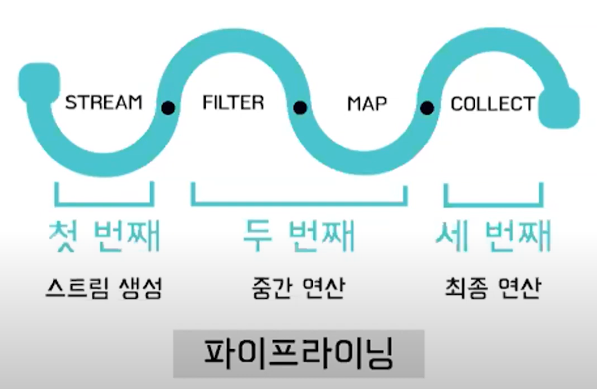

# 테코톡 춘식의 Stream 정리

## What is Stream ?

- 스트림은 데이터 처리 연산을 지원하도록 소스에서 추출된 연속된 값 ( From 모던 자바 )
- 스트림은 컬렉션의 요소를 하나씩 참조해 람다식으로 처리할 수 있는 반복자 ( From 이것이 자바다)

⇒ 스트림은 데이터 컬렉션 반복을 멋지게 처리하는 기능

### 스트림을 쓰는 이유

```java
BEFORE JAVA8
int sum = 0;
int count = 0;
for ( Employee emp : emps ) {
	if( emp.getSalary() > 100_100_100) {
		sum += emp.getSalary();
		count++;
	}
}
double average = (double) sum / count;

AFTER JAVA8

double average = emps.stream()
	.filter(emp -> emp.getSalary() > 100_100_00)
	.mapToInt(Employee::getSalary)
	.average()
	.orElse(0)
	;
```

- 연산에 필요한 매개변수 사용 X
- 객체에 지시하는 What 중심의 코드
- 자바 8 이전에는 외부반복
- 스트림을 사용하면 내부반복 , 직관적인 코드

### 컬렉션 요리사 , 스트림 요리사

- 컬렉션 요리사 : 주문된 코스요리를 모두 만들고 한꺼번에 넘겨준다.

  ⇒ 모든 값을 다 처리하고 넘겨주는 방식 `적극적 생성`

- 스트릠 요리사 : 주문된 코스요리에서 요리 완료된 음식부터 넘겨준다

  ⇒ 요청할 때마다 값을 처리 후 넘겨주는 방식 `게으른 생성`


⇒ 자료구조가 포함하는 **모든 값**을 메소드에 포함하는 `컬렉션`과 다르게

`스트림` 은 **요청할 때만** 요소를 계산 하는 고정된 자료구조를 가진다.

⇒ 스트림은 `특정 연산자를 사용할 때` 여러개의 조건이 중첩된 상황에서 값이 결정나면 불필요한 연산을 진행하지 않고 조건문을 빠져나와 실행 속도를 높인다.

⇒ 쇼트 서킷

### 사용법



- 스트림의 구조
    1. 컬렉션을 스트림으로 생성해주는 연산자
    2. 데이터를 처리하는 중간연산자
    3. 연산을 정리하고 결과를 도출하는 최종 연산자

filter → map → filter → map

루프퓨전 데이터 처리 방법 ( 중간연산자와 최종연산자의 반복 )

### flatMap

List<List<Fish>>

리스트 피쉬들이 모여있는 리스트 → 하나의 리스트로 만들고 싶을 때

List<List<Fish>> → Stream<List<Fish>>

1. flatMap(List::stream) → Stream<Fish>
2. collect.(Collectors.toList()) → List<Fish>

```java
List<Fish> manyFish = fishes.stream()
	.map(Net::getFishes)
	.flapMap(List::stream)
	.collect(Collectors.toList())
	;
```

### reduce

reduce(10 , (acc , x ) → acc + x )

각 요소를 소모해가면서 연산을 처리하는 방법 ( 다른 것들도 그렇지만 리듀스가 극단적으로 보여주는 예시 )

reduce 앞에 붙는 10 인 초기값 , 초기값을 안쓰면 Optional 을 반환