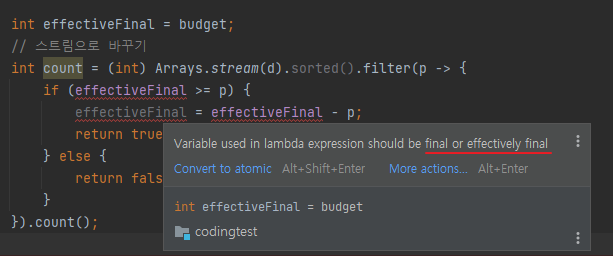

# 람다 표현식

+ 익명 클래스로 다양한 동작을 구현할 수 있지만 깔끔하지 않다
  - 람다를 통해 좀더 깔끔하게 구현 

### 3.1 람다란 무엇인가?
+ 람다 표현식은 메서드로 전달할 수 잇는 익명 함수를 단순화한 것이라고 할 수 있다.
+ 람다를 이용해서 자질구레한 코드를 간결한 방식으로 코드를 전달할 수 있다.
+ 그렇다고 자바 8 이전의 자바로 할 수 없었던 일을 제공하는 것은 아니다.
+ 다만 동작 파라미터를 이용할 때 익명 클래스 등 판에 박힌 코드를 구현할 필요가 없다.

### 기존 코드

```java
Comparator<Apple> byWeight = new ComParator<Apple>() {
    public int compare(Apple a1, Apple a2) {
            return a1.getWeight().compare(a2.getWeight());      
        }
};
```

### 람다를 이용한 개선 코드
```java
Comparator<Apple> byWeight =
        (Apple a1, Apple a2) -> a1.getWeight().compareTo(a2.getWeight());
```

### 람다 표현식은 파라미터, 화살표, 바디로 이루어진다.
+ 파라미터 리스트 : Comparator의 compare 메서드 파라미터(사과 두개)
+ 화살표 : 화살표는 람다의 파라미터 리스트와 바디를 구분
+ 람다 바디 : 두 사과의 무게를 비교한다. 람다의 반환값에 해당하는 표현식

### 람다 스타일

1. 표현식 스타일(expression style)
```java
(parameters) -> expression
```

2. 블록 스타일(block style)
```java
(parameters) -> { statements; }
```

### 3.2 어디에, 어떻게 람다를 사용할까?
+ 함수형 인터페이스라는 문맥에서 람다 표현식을 사용할 수 있다.
+ 함수 디스크립터 : 함수형 인터페이스의 추상 메서드 시그니처는 람다 표현식의 시그니처를 가르킨다. 람다 표현식의 시그니처를 서술하는 메서드를 함수 디스크립터라고 부른다.
+ '왜 함수형 인터페이스를 이수로 받는 메서드에만 람다를 사용할 수 있을까?'
  - 언어 설계자들이 복잡하게 만들지 않는 방법을 선택

### @FunctionalInterface는 무엇인가?
+ @FunctionalInterface는 함수형 인터페이스임을 가르키는 어노테이션이다.
+ @FunctionalInterface로 인터페이스를 선언했지만 실제로 함수형 인터페이스가 아니면 컴파일러가 에러를 발생시킨다.

### 3.3 람다 활용 : 실행 어라운드 패턴
+ 샘플 코드 참고

### 3.4 함수형 인터페이스 사용

### Predicate
+ Predicate 인터페이스는 test라는 추상 메서드를 정의하며 test는 제네릭 형식의 T의 객체를 인수로 받아 불리언을 반환한다.

### Consumer
+ Consumer 인터페이스는 제네릭 형식 T 객체를 받아서 void를 반환하는 accept라는 추상 메서드를 정의한다.

### Function
+ Function 인터페이스는 제네릭 형식 T를 인수로 받아서 제네릭 형식 R 객체를 반환한다.

### 박싱 언박싱
+ 박싱 : 기본형을 참조형으로 변환
+ 언박싱 : 참조형을 기본형으로 변환

### 3.5 형식 검사, 형식 추론, 제약

#### 3.5.4 형식 추론
+ effective final : 변수에 final이 붙지 않았는데 실질적으로 final처럼 사용하는 변수
+ 람다 캡처링 : final이거나 effective final인 경우에만 람다안에서 사용가능 한것

+ 

### 3.6 메소드 참조
#### 3.6.1 메소드 참조의 세 가지 유형
1. 정적 메서드 참조
>  예를들어 Integer의 parseInt 메서드는 Integer::parseInt로 표현
2. 다양한 형식의 인스턴스 메서드 참조
> 예를들어 String의 length 메서드는 String::length로 표현
3. 기존 객체의 인스턴스 메서드 참조
> 예를들어 Transaction 객체를 할당받은 expensiveTransaction 지역 변수가 있고,
> Transaction 객체에는 getValue 메서드가 있다면, 이를 expensiveTransaction::getValue라고 표현할 수 있다.


