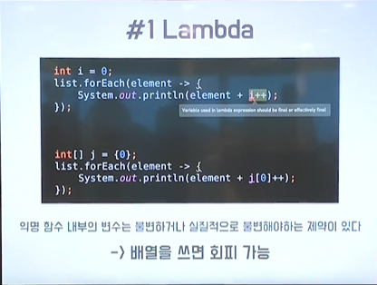
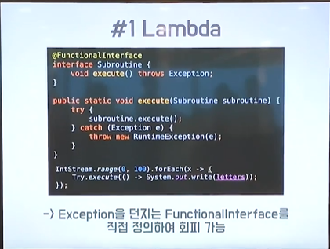

# 도넛의 함수형 프로그래밍

### 힐베르트 프로그램
+ 완전성
+ 무모순성

### 튜링 머신과 정지 문제

### 함수형 프로그램이란 무엇인가?
+ 수학에서의 함수로 프로그래밍하는 것과 같다고 생각하면 됨

### 함수형 프로그래밍의 요소들
+ 고계 함수
+ 일급 함수
+ 커링과 부분 적용
+ 재귀와 꼬리 재귀 최적화
+ 멱등성
+ 순수 함수와 참조 투명성
+ 불변성과 영속적 자료구조. 메모이제이션

### 왜 함수형 프로그래밍 언어인가?
1. 높은 표현력을 통해 불필요한 코드를 줄일 수 있다.
2. 함수형 프로그래밍 언어군은 프로그래밍 언어론의 최신 연구 결과를 반영하고 있다.

### 모나드Monad 결론
+ 그는 실제 세계의 프로그램은 단순히 한 값에서 다른 값으로 이어지는 함수가 아니라 그 값에 대한 계산을 구성하는 변환이라는 것을 깨달았다.
+ 그냥 결과로 나오는 타입을 잘 맞춰주면서 쓰면 된다.

### 람다
+ 익명 함수 내부의 변수는 불변하거나 실질적으로 불변해야하는 제약이 있다.
    - 배열을 쓰면 회피 가능

+ 익명 함수는 Checked Exception을 던질 수 없어서 반드시 내부에 Try-catch문을 써줄 수 밖에 없다.
    - Exception을 던지는 FunctionalInterface를 직접 정의하여 회피 가능

### 커링
+ 커리 함수를 만들면 어느 함수나 커링 가능

### CompletedFuture
+ CompletedFuture는 프로미스이다.

### Optional
+ Optional은 값이 존재하거나 존재하지 않음을 나타내는데, 이를 Exception 대신에 활용할 수 있다.
+ 모든 예외 처리를 Optional로 대신하는 것은 좋지 않다.